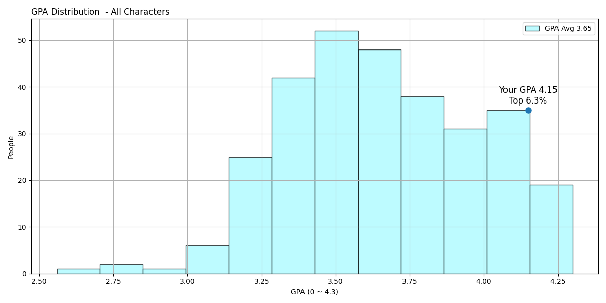

# ✨AOOP Final Project 2025

###  Lazy Me Today Too 今天的我也想耍廢😎 ——— 模擬人生大學版

📦 [Github Release](https://github.com/xiaotin22/aoop-2025-proj-group3/releases/tag/v1.0.0)
📦 [桌面版執行檔下載](https://drive.google.com/drive/folders/1e8xFppjzU4zMVT06rckOlk794lzat7y4?usp=sharing)

GIF 素材來源：\
[素材來源](https://www.aigei.com/s?q=一二布布)

<p align="center">
  
</p>


<p align="center">
  
</p>

**本專案為 114-1 陽明交通大學（NYCU）由王學誠老師開設的物件導向程式設計（AOOP）課程的期末成果。專案開發使用 Python, Pygame 的一些函式庫，同樣利用在課程中學習到的函式庫如 numpy, matplotlib等...** 

Group3 開發人員如下：
* NYCU_EE [113511116 tpvupu](https://github.com/tpvupu) : 陳欣怡
* NYCU_EE [113511266 xiaotin22](https://github.com/xiaotin22)：楊庭瑞

## 🌟遊戲介紹

**本遊戲可根據玩家的喜好選擇自己想要的玩家進行遊戲，共有四種選擇，四隻角色具有不同的特色及亮點✨**

<p align="center">
  
</p>

<p align="center">
  
</p>

## 🎉事件選擇與考試結算

**本遊戲會根據不同的事件選擇，對角色狀態的改變，再進行評估成績**

<p align="center">
  
</p>

<p align="center">
  
</p>

<p align="center">
  
</p>

## 🥚小彩蛋 --- 輪盤抽籤

**除了主要的小介面，本專案另設有些小彩蛋，歡迎各位前往遊玩～**

<p align="center">
  
</p>

## 😎模擬大學GPA系統

**使用python 函式庫 matplotlib 畫出由300次隨機選擇的分布圖，角色的每一步選擇都會影響最後的學期GPA**

<p align="center">
  
</p>

## OpenAI API System
本專案另增加AI的即時回覆系統，通過提供OpenAI API一些適當的prompt
,讓OpenAI回傳給遊戲內，自動生成回覆。
<p align="center">
  
</p>

**參考 [Open AI API 申請](https://platform.openai.com/docs/quickstart) 獲得個人API KEY**
,使用玩家需在terminal引入OpenAI Key，指令如下 :

``` bash
export OPENAI_API_KEY="your_api_key_here"
```


## 📂 專案架構 (Project Structure)
``` bash
aoop-2025-proj-group3/
│
├── main.py                      # 主程式入口，負責遊戲流程控制
├── character.py                 # 角色類別與屬性、行為邏輯
├── scene_manager.py             # 用以控制Scene之間的切換
├── setting.py                   # 用以設定遊戲參數
│
├── UI/
│   ├── start_scene.py           # 遊戲開場介面
│   ├── intro_scene.py           # 遊戲介紹場景
│   ├── character_select.py      # 角色選擇場景 
│   ├── main_scene.py            # 遊戲主畫面場景
│   ├── story_scene.py           # 劇情推進場景
│   ├── event_scene.py           # 事件觸發場景
│   ├── end_scene.py             # 遊戲結束/結局場景
│   ├── rank_scene.py            # 排行介面
│   ├── lucky_wheel_scene.py     # 幸運轉盤小遊戲
│   ├── diary_scene.py           # 日記本系統
│   ├── ...
│   └── components/
│       ├── audio_manager.py      # 音效/音樂管理單例
│       ├── base_scene.py         # 場景基底類別
│       ├── character_animator.py # 角色動畫管理
│       └── ...                   # 其他 UI 元件
│
├── simulation_plots/            # 模擬成績，繪製圖形存放
│
├── resource/
│   ├── font/                    # 字型檔案
│   ├── image/                   # 圖片、背景、角色圖
│   └── music/
│       ├── bgm/                 # 背景音樂
│       └── sound_effect/        # 音效檔案
│
├── event/
│   ├── event.json               # 各週事件資料
│   └── game_setting/            # 遊戲劇情文件
│
├── AI/                          # 模擬系統
│   ├── bvtree.py                # 選擇行為樹策略
│   ├── simulation.py            # 模擬程式
│   └── test_...py               # 其他測試檔
│
├── README.md                    # 專案說明文件
├── Docker/
```
---
## [Class Diagram](./event/game_setting/class_diagram.md)

## 🛠️ 安裝與執行 (建置虛擬環境版）

如果想要在自己的本機執行這個遊戲，請依照下列步驟執行呦～

### 必要條件

* Python 3.12 + 
* Git
  
### 安裝步驟

1.  **Clone 專案庫**
    ```bash
    git clone https://github.com/xiaotin22/oop-2025-proj-group10.git
    cd oop-2025-proj-group10
    ```

2.  **建立並啟用虛擬環境 (強烈建議)**
    * 在 Windows 上:
        ```bash
        python -m venv venv
        .\venv\Scripts\activate
        ```
    * 在 macOS / Linux 上:
        ```bash
        python3 -m venv venv
        source venv/bin/activate
        ```

3.  **安裝相依套件**
    ```bash
    pip install -r Docker/requirements.txt
    ```

4.  **執行遊戲！**
    ```bash
    python main.py
    ```

---

## 🌐 網頁版部署 (GitHub Pages)

### 快速開始 - 在線遊玩

遊戲已經部署到 GitHub Pages，可以直接在瀏覽器中遊玩：
**[立即遊玩](https://yourname.github.io/aoop-2025-proj-group3/)**

> ⚠️ 注意：首次載入可能需要較長時間（約 1-2 分鐘），請耐心等待

### 本地構建 Web 版本

如果你想在本地構建並測試 Web 版本：

1. **安裝 pygbag**
   ```bash
   pip install pygbag
   ```

2. **構建遊戲**
   ```bash
   # 使用提供的腳本
   ./build_web.sh
   
   # 或手動構建
   pygbag --build main.py
   ```

3. **本地測試**
   ```bash
   # 啟動本地伺服器
   python -m http.server --directory build/web 8000
   
   # 在瀏覽器中打開
   # http://localhost:8000
   ```

### 自動部署到 GitHub Pages

專案已配置 GitHub Actions 自動部署workflow。每次推送到主分支時，會自動：
1. 構建 Web 版本
2. 部署到 GitHub Pages

**設置步驟：**
1. 進入你的 GitHub 倉庫設置
2. 點擊 "Pages" 標籤
3. Source 選擇 "GitHub Actions"
4. 推送代碼後，等待 Actions 完成部署

### Web 版本特性

✅ **支援功能：**
- 完整的遊戲體驗
- 音效和背景音樂
- 角色動畫
- 數據持久化（瀏覽器本地存儲）

❌ **限制：**
- OpenAI API 功能在 Web 版本中不可用（需要 API key）
- 首次載入較慢（需下載所有資源）

--- About Our Docker 🚀
**除了上述的虛擬環境，也可以使用我們建置的 Docker ~**

🧰 前置需求（第一次才需要）

### Step1 : 安裝 Docker (如果沒有裝過的話)  
   [👉 Docker 官方下載連結](https://www.docker.com/products/docker-desktop)

### Step2: Clone 這個 repo 到你的電腦：
```
cd ~
git clone https://github.com/xiaotin22/oop-2025-proj-group10.git
cd oop-2025-proj-group10
```
### Step3: 進入Docker
```
source docker_run.sh
```
# 專案打包指南

## 快速開始

### macOS（.app）

1) 安裝依賴
```bash
pip install -r requirements.txt
chmod +x build.sh
./build.sh
```

2) 產物
- `dist/LazyMeTodayToo.app`
- 需要 OpenAI 時，放 `.env` 於 `dist/`：`OPENAI_API_KEY=sk-...`

### Windows（.exe，請在 Windows 環境執行）

1) 安裝依賴
```cmd
pip install -r requirements.txt
pip install pyinstaller
```

2) 打包
```cmd
pyinstaller build.spec
```

3) 產物
- `dist/LazyMeTodayToo/` 內有執行檔，整個資料夾一起發布
- 如需單檔：
```cmd
pyinstaller --onefile --windowed --icon resource/image/Mitao_head.ico build.spec
```

---

## 常見問題

### Q1: 打包後無法找到資源文件
**A:** 確保所有資源文件都在 `build.spec` 的 `datas` 列表中

### Q2: 打包檔案太大
**A:** 
- 使用虛擬環境，只安裝必要的套件
- 考慮移除不必要的依賴（如 pytest）

### Q3: macOS 提示「無法打開應用程式，因為它來自未識別的開發者」
**A:** 
```bash
# 臨時允許執行
xattr -cr dist/LazyMeTodayToo.app

# 或在系統偏好設定 > 安全性與隱私權中允許
```

### Q4: 程式執行時出現錯誤
**A:** 
- 暫時設置 `console=True` 查看錯誤訊息
- 檢查所有資源路徑是否正確

---

## 進階設定

### 添加圖示

- macOS：使用 `resource/image/Mitao_head.png`，`build.sh` 會自動轉出 `Mitao_head.icns` 並套用
- Windows：放置 `resource/image/Mitao_head.ico`，`build.spec` 會自動帶入；若缺少則使用預設圖示

### 優化打包大小

1. 使用虛擬環境
   ```bash
   python -m venv venv
   source venv/bin/activate  # macOS
   pip install -r requirements.txt
   ```

2. 排除不需要的模組
   在 `build.spec` 的 `excludes` 中添加：
   ```python
   excludes=['pytest', 'test', 'pygbag'],
   ```

### 跨平台打包建議

- 無法在 macOS 上直接生成 Windows exe
- 無法在 Windows 上直接生成 macOS app
- 建議使用 CI/CD 或虛擬機進行跨平台打包

---

## 檔案說明

- `build.spec`: PyInstaller 配置文件
- `build.sh`: macOS 打包腳本
- `dist/`: 打包輸出目錄
- `build/`: 臨時構建文件（可刪除）

---

## 發布檢查清單

- [ ] 測試打包後的應用程式是否能正常運行
- [ ] 檢查所有資源文件是否正確載入
- [ ] 測試音效、圖片、字體是否正常顯示
- [ ] 在乾淨的系統上測試（無 Python 環境）
- [ ] 準備 README 給使用者


